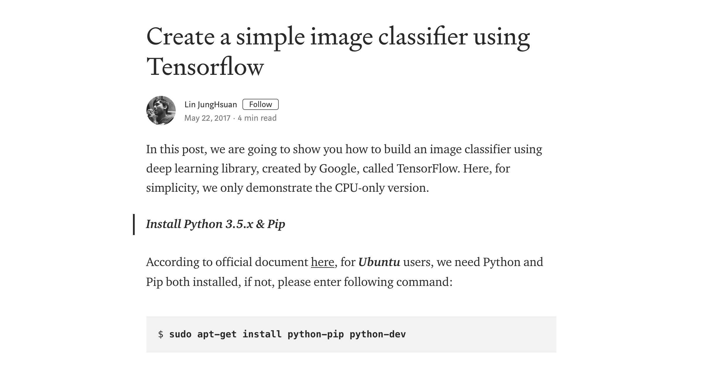
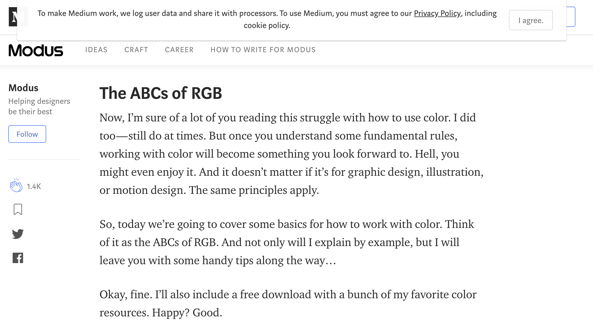

# Clear Medium

Chrome extension to remove all annoying floating/sticky/popup stuff from medium articles.

Enjoy Medium articles like this:

instead of this:

## Installation

- clone the repo
- open chrome, navigate to `chrome://extensions`
- tick `Developer mode`
- hit the `Load unpacked` button
- load the content of the repo

## Contribution

Feel free to fork, PR-s are warmly welcomed, especially blacklist additions.